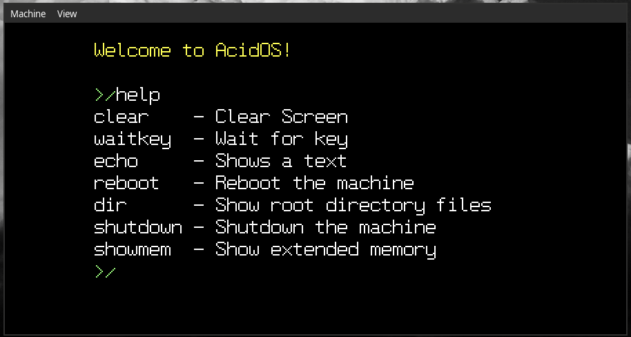
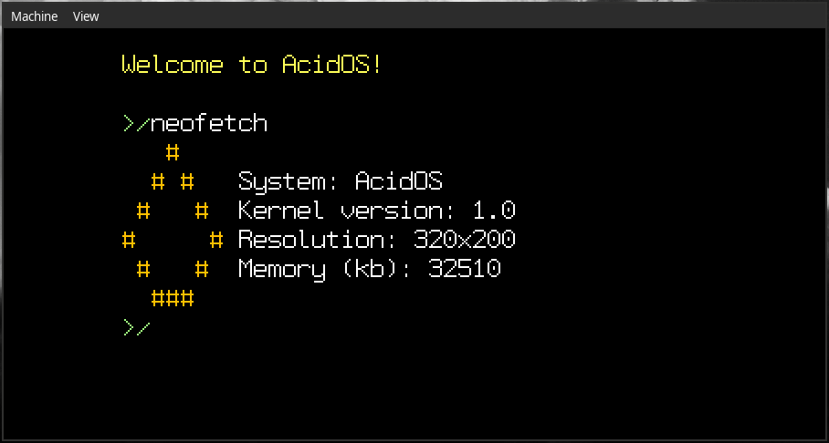
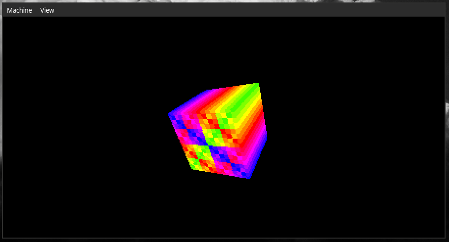
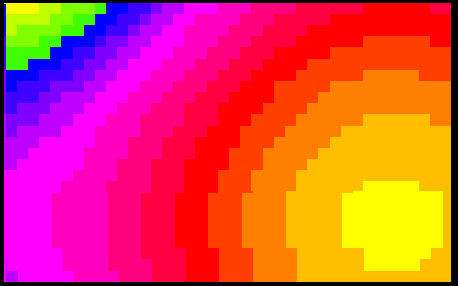

# 🧪 About AcidOS
AcidOS is a small real mode operating system made in 8086 Assembly. This project is being developed as a way to learn more about OSs.   

# 🛠️ Current Progress
- ✅ **BIOS Parameter Block**
- ✅ **Extended Boot Record**
- ✅ **FAT12 Filesystem**
- ✅ **Bitmap Fonts**
- ✅ **Shell**
- ✅ **Running programs**
- 🚧 **Memory Management**

# 🚀 Future Ideas
- **C Library**

# ⚙️ Building
### 🧰 Necessary Components
nasm
### 📄 Compiling
`chmod +x ./make.sh`  
`./make.sh` 
### 🚀 Running
use `qemu-system-i386 -drive format=raw,file="AcidOS.img"`

# 🤝 Contribute
For those who want to contribute to AcidOS, you can help me starring/forking this project or help with code using pull requests.

# 🌟 Credits
Nikitpad - Originally made the cube
Nanochess - Made the CubicDOOM
